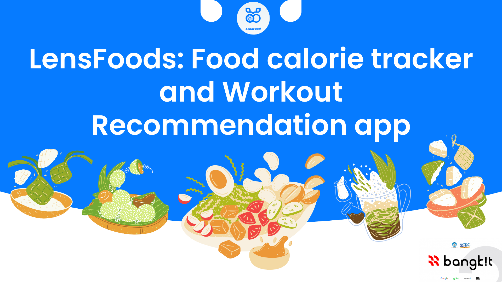

  
  alt="LensFood Logo"

# LensFood: Food Calorie Tracker and Workout Recommendation

> In Indonesia, where over 30% of adults struggle with obesity, We see the rising rates of obesity in Indonesia, and it worries us. We believe everyone deserves to feel healthy and energized. That's why we're creating this application
Our vision is a mobile app that can detect food calories and provide personalized workout recommendations. Imagine this: you snap a picture of your lunch, and the app instantly tells you its calorie content! This information is then integrated with a personalized workout system, guiding you toward effective exercises that fit your fitness level and goals.
We believe machine learning holds the key to unlocking a personalized approach to health management. Our app will harness this power to make healthy living easier and more accessible. We envision it as a holistic health companion, seamlessly integrating with wearable devices and health data platforms to provide a comprehensive view of your well-being.
Through continuous user testing and evaluation, we're committed to refining the app's usability and effectiveness. Our goal is to make it an indispensable tool for anyone seeking to take control of their health and embrace a healthier lifestyle.
Together, we believe that our calorie detection and workout recommendation app can make a significant impact in the fight against obesity. By empowering individuals with informed choices, we hope to improve health outcomes and create a more fulfilling life for all.

> We need **nutrition** for our body, but we rarely know **how much nutrition and what foods** can fulfill them. According to that situation, the problem is **how to calculate the nutrition of foods** that our body needs. The **solution** is to help other people to **organize their diet** to their **ideal body nutrition needs**. Our idea is to make an Android-based application with a machine learning model to **calculate how much nutrition** the user needs and give a **recommendation** about what **foods with nutrition** and **exercise** that is suitable for the user.

---

## Infrastructure Design

---

## Our Members [C241-PS291]

### Machine Learning Division
| Bangkit ID | Name | University | Profile |
|:----------:|:----:|:----------:|:-------:|
|M012D4KX3083|Hairunissa Rizka Utiarahman|Telkom University||
|M117D4KY1422|Keindra Bagas Maulana|Institut Teknologi Nasional Bandung||
|M012D4KY2302|Ishfahan Dzilalin Nuha|Telkom University||

### Cloud Computing Division
| Bangkit ID | Name | University | Profile |
|:----------:|:----:|:----------:|:-------:|
|C550D4NY1361|Davin Sya’ban Perdana|UIN Syarif Hidayatullah Jakarta||
|C299D4KY0334|Muhammad Tiar Zuhairmawan|Universitas Pendidikan Indonesia||

### Mobile Development Division
| Bangkit ID | Name | University | Profile |
|:----------:|:----:|:----------:|:-------:|
|A117D4KY3638|Ajri Inda Robby|Institut Teknologi Nasional Bandung||
|A299D4KX3906|Syahla Ismah Aprilia|Universitas Pendidikan Indonesia||

---

## Implementation

---

---

## Infrastructure Design

---
